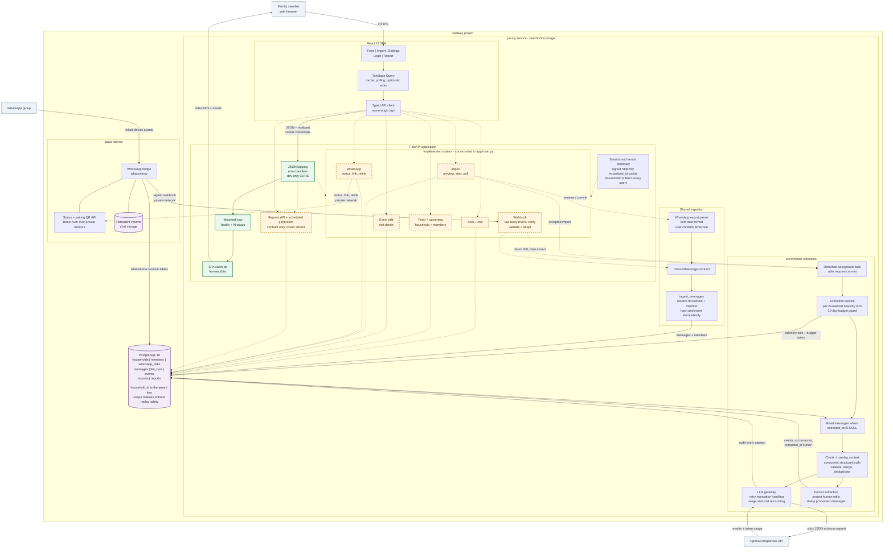

# Penny architecture

Penny is a same-origin React and FastAPI application. Families can backfill a WhatsApp `.txt`
export or receive live group messages through GOWA; both paths converge on one idempotent ingestion
boundary and one extraction service.

> [!NOTE]
> This diagram describes the current working tree. Solid green nodes are active in
> `app/main.py`. Dashed amber nodes are inactive: most are implemented routers that are not
> currently registered. Reports have a frontend route, API contract, and database model, but no
> backend router yet.

## Runtime status

- `app/main.py` currently includes only the health and AI routers before mounting the SPA.
- Auth, feed, event, household, import, member, webhook, and WhatsApp routers exist in
  `backend/app/routers/` but are not reachable until they are included in `app/main.py`.
- The report screens, API contract, and `reports` table exist; report endpoints and generation are
  not implemented.
- Production builds the SPA in the first Docker stage, copies it into the Python image, runs
  Alembic in Railway's pre-deploy phase, and serves the SPA and API from one origin.

## Architectural invariants

- Every tenant-owned row carries `household_id`; request dependencies apply that boundary to reads
  and writes.
- Live webhooks and file imports normalize to the same `InboundMessage` contract and call the same
  ingestion function.
- Message replay safety lives in PostgreSQL unique indexes, not in request handlers.
- `messages.extracted_at IS NULL` is the resumable extraction cursor.
- Human-edited event fields and soft-deleted event tombstones survive later extraction runs.
- Every LLM attempt is recorded with model, prompt version, usage, latency, cost, and outcome.
